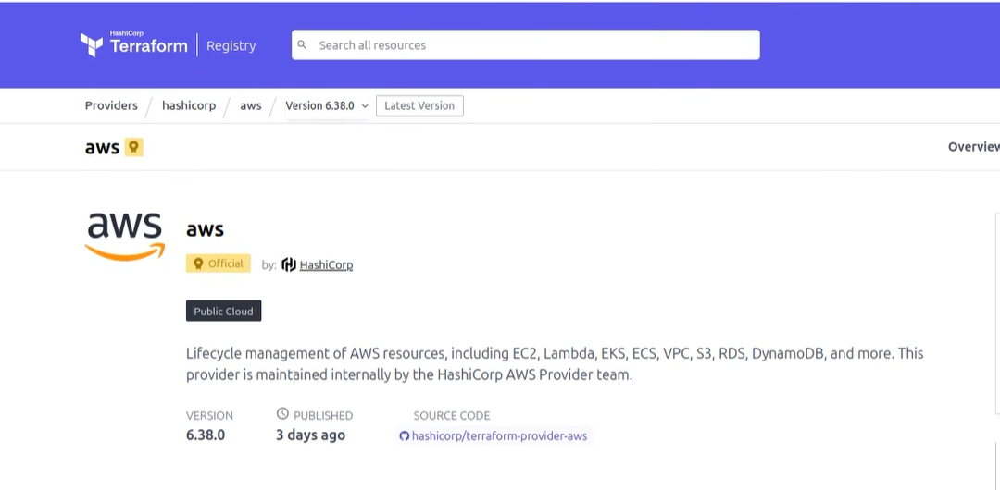

首先去 创建一个 ima user 
然后创建access key and secret key. 
aws config 配置the local machine, 
aws configure --profile=terraform-aws  这个用户是 aws iam user的name.
export AWS_PROFILE=terraform-aws
export AWS_REGION=us-east-1
export AWS_ACCESS_KEY_ID=your_access_key_id 
export AWS_SECRET_ACCESS_KEY=your_secret_access_key
aws  sts get-caller-identy 可以 来verify 这个 aws 用户配置是否正确

cd terrafrom/  terrafrom init -- download all the modules and providers. 在 terrafrom diertyor中
可以去 terraform provider中查看最新的version 然后就可以

run  terrafrom  plan    一共有77 resource
terraform apply -auto-approve

it will take 15-20 mins to apply the changes and deploy the resources.

然后去 console中验证， as you can see， 有eks cluster, vpc, ec2中去严重 bastion node and 2 work node在运行， we can only mange the eks via the bastion host， 或者直接使用 aws session manger
也能看到  bastion-ky.pem 文件。 
我想问这里面创建的eks 能否使用aws session 来远程链接呢》

ssh -i  bastion-key.pem  ubuntu@public ip
sudo su  && sudo  apt-get update

如果想 store the  tfstate in  s3 bucket, 我们需要另外一个 backend.tf/ remoke-backend,手动创建一个  s3bucket 来存储 tfstate 
可以使用命令来创建。eanable versioning and encriyttpon.再 田间  backend "s3" { bucket name , key,} map
运行 terrafrom init   copy exising tfstate 到 新的 s3 bucket. 

需要安装aws cli, helm, kubectl,  eksctl(manage the eks cluster) -- 还需要aws config 和 eks config 在这个bastion中 ， path 是  ~/.aws/credentials
unzip 和 tar 有什么区别？ unzip 是 zip 文件？ 哪个用的多啊？
安装之后进行verify  aws version. 
aws eks update-kubeconfig --name terraform-eks-cluster --region us-east-1
kubctl config current-context 来verify
kubeckt get nodes 也可以verify

install aws load balancer controller

创建 eks cluster的时候已经 默认黄健 oidc provider,
我们现在需要iam
aws eks describe-clusert --name  --qery "cluster.identiy.iidc.issuer" --output text
然后创建 iamploucy 并且  create service aaccount aatache the iam plicy 到 这个 sa.

install helm 
helm repo update eks,
helm install aws-load-balancer-cortroller
helm update -i       -n kube-system  
其中一个feature是  gatewayAPI= true

然后进行验证  k get deployment -n kube-system aws-load-balancer

